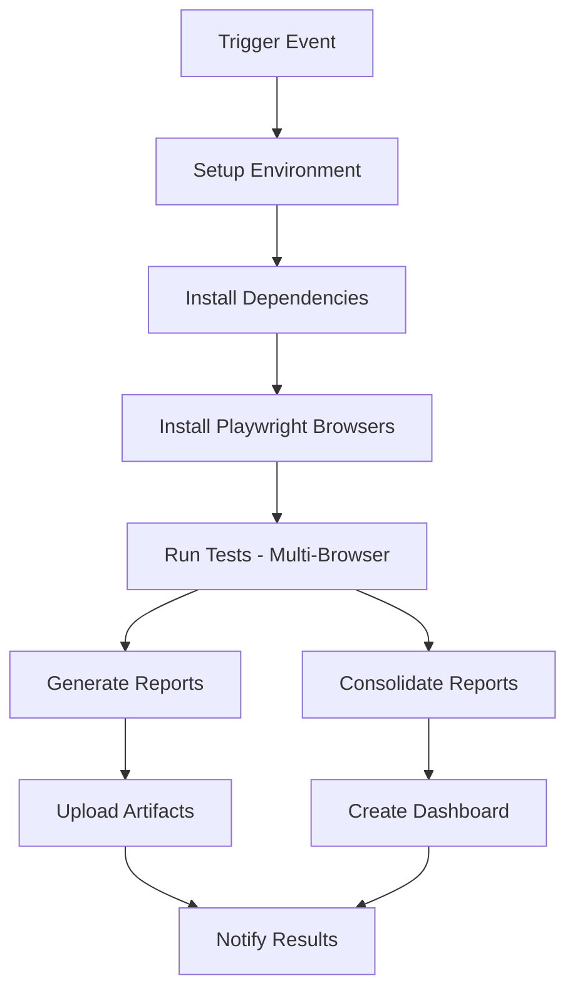

# 🚀 CI/CD Pipeline Documentation
## Playwright Test Automation - SauceDemo Login Tests

This document outlines the complete CI/CD pipeline setup for automated testing of the SauceDemo login functionality.

## 📋 Pipeline Overview

### Automated Triggers
- **🕰️ Scheduled Runs**: Monday to Friday at 8:00 AM UTC
- **🔄 Push Events**: Triggered on commits to `main`/`master` branch
- **📥 Pull Requests**: Automated testing for all PRs to `main`/`master`
- **⚡ Manual Dispatch**: On-demand execution with custom parameters

### Pipeline Architecture


## 🎯 Features

### ✨ Core Capabilities
- **Multi-Browser Testing**: Chromium, Firefox, WebKit support
- **Flexible Test Types**: Full, Smoke, Regression test suites
- **Comprehensive Reporting**: JUnit XML, JSON, HTML, Universal Dashboard
- **Artifact Management**: 30-day retention with organized structure
- **Smart Notifications**: GitHub Summary, optional Slack/Email
- **Parallel Execution**: Matrix strategy for efficient testing

### 📊 Report Generation
1. **Individual Browser Reports**: Detailed per-browser results
2. **Consolidated Dashboard**: Multi-browser overview
3. **JUnit XML**: CI/CD integration format
4. **Interactive HTML**: Playwright's rich debugging interface
5. **Universal Analytics**: Combined metrics and insights

## 🔧 Configuration

### Environment Variables
```yaml
NODE_VERSION: '18'           # Node.js runtime version
PLAYWRIGHT_BROWSERS_PATH: '0' # Browser installation path
```

### Matrix Strategy
The pipeline supports flexible browser testing:
- **Default**: Chromium only
- **Manual**: Choose specific browser or 'all'
- **Parallel**: All browsers run simultaneously

### Test Type Configuration
- **Full**: Complete test suite execution
- **Smoke**: Critical path tests only (`--grep "smoke|login"`)
- **Regression**: Full regression test suite

## 🎮 Usage Guide

### Manual Execution
1. Navigate to **Actions** tab in GitHub repository
2. Select **"🎭 Playwright Test Suite"** workflow
3. Click **"Run workflow"**
4. Configure parameters:
   - **Test Type**: `full` | `smoke` | `regression`
   - **Browser**: `chromium` | `firefox` | `webkit` | `all`

### Monitoring Results
1. **GitHub Actions Summary**: Real-time status and metrics
2. **Artifacts Section**: Download detailed reports
3. **Universal Dashboard**: Comprehensive analytics view
4. **Individual Reports**: Browser-specific debugging data

## 📁 Artifact Structure

```
test-results/
├── junit-{browser}.xml          # JUnit test results
├── results-{browser}.json       # JSON test results
├── universal-dashboard-{browser}.html
└── playwright-report-{browser}/  # Interactive HTML reports

consolidated-reports/
├── junit-combined.xml           # Merged JUnit results
├── ci-dashboard.html           # Multi-browser dashboard
└── playwright-report-*/        # All browser reports
```

## 📈 Dashboard Features

### CI/CD Dashboard Includes:
- **🎯 Build Metrics**: Run number, branch, triggered by
- **🌐 Browser Coverage**: Multi-browser test results
- **📊 Status Overview**: Pass/fail indicators
- **🔗 Quick Navigation**: Direct links to detailed reports
- **⏰ Timestamps**: Execution timing information

### Universal Analytics:
- **Test Execution Trends**: Historical pass/fail rates
- **Browser Compatibility**: Cross-browser performance
- **Performance Metrics**: Test duration and efficiency
- **Error Analysis**: Failure categorization and patterns

## ⚙️ Advanced Configuration

### Custom Schedules
Modify the cron expression in `.github/workflows/playwright-tests.yml`:
```yaml
schedule:
  - cron: '0 8 * * 1-5'  # 8 AM UTC, Monday-Friday
  # - cron: '0 */6 * * *'  # Every 6 hours
  # - cron: '0 0 * * 0'    # Weekly on Sunday
```

### Notification Setup
Uncomment and configure notification sections:

#### Slack Integration
```yaml
env:
  SLACK_WEBHOOK_URL: ${{ secrets.SLACK_WEBHOOK_URL }}
```

#### Email Notifications
```yaml
env:
  EMAIL_USERNAME: ${{ secrets.EMAIL_USERNAME }}
  EMAIL_PASSWORD: ${{ secrets.EMAIL_PASSWORD }}
```

### Browser Configuration
Add or modify browsers in the matrix:
```yaml
strategy:
  matrix:
    browser: ['chromium', 'firefox', 'webkit', 'edge'] # Add edge if needed
```

## 🔍 Troubleshooting

### Common Issues
1. **Test Failures**: Check individual browser reports for detailed error traces
2. **Browser Installation**: Verify Playwright browser dependencies
3. **Timeout Issues**: Increase `timeout-minutes` for slower environments
4. **Artifact Upload**: Ensure proper file paths and permissions

### Debug Steps
1. **Review GitHub Actions Logs**: Detailed execution timeline
2. **Download Artifacts**: Local analysis of generated reports
3. **Run Locally**: Replicate issues in development environment
4. **Check Dependencies**: Verify Node.js and Playwright versions

## 📊 Metrics & Analytics

### Key Performance Indicators
- **Test Pass Rate**: Overall success percentage
- **Browser Compatibility**: Cross-browser consistency
- **Execution Time**: Pipeline efficiency metrics
- **Failure Patterns**: Common error categorization

### Historical Tracking
- **Trend Analysis**: Pass/fail rates over time
- **Performance Monitoring**: Execution speed improvements
- **Quality Gates**: Automated quality thresholds
- **Regression Detection**: Automated failure pattern analysis

## 🔐 Security & Best Practices

### Repository Secrets
Store sensitive configuration in GitHub Secrets:
- `SLACK_WEBHOOK_URL`: Slack notification endpoint
- `EMAIL_USERNAME` / `EMAIL_PASSWORD`: Email credentials
- `TEST_CREDENTIALS`: Application test accounts (if needed)

### Access Control
- **Branch Protection**: Require CI/CD success for merges
- **Review Requirements**: Mandatory code reviews
- **Status Checks**: Block merges on test failures

## 🚀 Getting Started

### Prerequisites
1. ✅ Playwright project with test files
2. ✅ GitHub repository with Actions enabled
3. ✅ Node.js package.json with dependencies
4. ✅ Playwright configuration file

### Setup Steps
1. **Copy Workflow File**: Ensure `.github/workflows/playwright-tests.yml` is present
2. **Configure Secrets**: Add any required environment variables
3. **Test Manual Run**: Execute workflow manually to verify setup
4. **Monitor Scheduled Run**: Verify automatic execution at 8 AM UTC
5. **Review Reports**: Access artifacts and dashboards

### Customization
1. **Modify Schedule**: Update cron expression for different timing
2. **Add Browsers**: Extend matrix strategy for additional coverage
3. **Configure Notifications**: Enable Slack/email alerts
4. **Customize Reports**: Modify dashboard templates

## 📞 Support & Enhancement

### Current Version
- **Pipeline Version**: v1.0
- **Playwright Version**: 1.58.2
- **Node.js Version**: 18
- **Report Formats**: JUnit XML, JSON, HTML, Universal Dashboard

### Future Enhancements
- **Performance Testing**: Load testing integration
- **Visual Regression**: Screenshot comparison
- **API Testing**: Backend service validation
- **Mobile Testing**: Device simulation coverage
- **Security Scanning**: Automated security checks

---

*📖 For questions or enhancements, please create an issue in the repository or contact the QA team.*